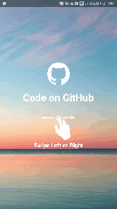
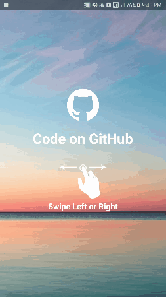

# Reside Menu

In this project i implemented a menu using view pager. To implement this menu , i use view pager. First and third page are the menu page ,
and second page is our content frame.

When we slide our page , say left to right. when first menu appear. What i have done is.
 
 * Set the page translation of first page (one with negative position offset) to 0.
 * Resize The content page.
 * Shift the content page to align to parent right.
 
 **PageTransformer** is the interface which will control all our transformation.
 
 ```java
 public class HorizontalReside implements ViewPager.PageTransformer {
    @Override
    public void transformPage(View page, float position) {

        //Hiding those pages which are way off-screen to the left or to the right.
        if (position < -1) {
            page.setAlpha(0);
        } else if (position > 1) {
            page.setAlpha(0);
        } else {
            page.setAlpha(1);
        }


        if (page.getId() == R.id.menuFirst){
            //putting fragment to the start of the screen
            page.setTranslationX(-position*page.getWidth());
        }
        else if (page.getId() == R.id.contentPage){
            //when we swipe to left this code applied
            if (position <= 0){
               //for each transformation CODE is mentioned below
            }
            //when we swipe to right this code applied
            else if (position > 0){
              //for each transformation CODE is mentioned below
            }
        }
        else if (page.getId() == R.id.menuSecond){
            //putting fragment to the start of the screen
            page.setTranslationX(-position*page.getWidth());
        }
    }
}
```
In above code **R.id.menuFirst** & **R.id.menuSecond** are left and right menu fragments respectively, so we set them to the start of the screen.

**R.id.contentPage** is the fragment which is always visible to user when the user starts the app. For this we have to code the animation **When the user swipe to left** and **When the user swipe to right**.
Also to show **R.id.contentPage** on top set this fragment parent layout elevation by doing this the fragment comes over the first frgament.
```xml
android:elevation="10dp"
```
To set **R.id.contentPage** is always shown to user whenever user starts the app you can use this
```java
viewPager.setCurrentItem(1);
```

You can download the latest sample APK from Google Play store:

<a href="https://play.google.com/store/apps/details?id=com.kumar.dipanshu.residemenu">
  
</a>

 ## Horizontal Reside Menu
 
 
 
 ```java
            if (position <= 0){

                //first we do scaling to 50%
                float scale = Math.max(0.6f,1-Math.abs(position));
                page.setScaleX(scale);
                page.setScaleY(scale);

                float deltaWidth = page.getWidth() - scale*page.getWidth();

                //place the fragment to the start of the screen and move the fragment to left
                page.setTranslationX(-position*page.getWidth() - deltaWidth/2);

            }
            //when we swipe to right this code applied
            else if (position > 0){

                //first we do scaling to 50%
                float scale = Math.max(0.6f,1-Math.abs(position));
                page.setScaleX(scale);
                page.setScaleY(scale);

                float deltaWidth = page.getWidth() - scale*page.getWidth();

                //place the fragment to the start of the screen and move the fragment to right
                page.setTranslationX(-position*page.getWidth() + deltaWidth/2);

            }
```

## Vertical Reside Menu



```java
            //when we swipe to left this code applied
            if (position <= 0){

                //first we do scaling to 50%
                float scale = Math.max(0.6f,1-Math.abs(position));
                page.setScaleX(scale);
                page.setScaleY(scale);

                float deltaHeight = page.getHeight() - scale*page.getHeight();

                //move the fragment to top
                page.setTranslationY(+deltaHeight/2);

            }
            //when we swipe to right this code applied
            else if (position > 0){

                //first we do scaling to 50%
                float scale = Math.max(0.6f,1-Math.abs(position));
                page.setScaleX(scale);
                page.setScaleY(scale);

                float deltaHeight = page.getHeight() - scale*page.getHeight();

                //move the fragment to bottom
                page.setTranslationY(-deltaHeight/2);

            }
```

## Corner Reside Menu


```java
            //when we swipe to left this code applied
            if (position <= 0) {

                //first we do scaling to 50%
                float scale = Math.max(0.5f, 1 - Math.abs(position));
                page.setScaleX(scale);
                page.setScaleY(scale);

                float deltaHeight = page.getHeight() - scale * page.getHeight();
                float deltaWidth = page.getWidth() - scale * page.getWidth();

                //move the fragment to top
                page.setTranslationY(+deltaHeight / 2);
                //place the fragment to the start of the screen and move the fragment to left
                page.setTranslationX(-position * page.getWidth() - deltaWidth / 2);

            }
            //when we swipe to right this code applied
            else if (position > 0) {

                //first we do scaling to 50%
                float scale = Math.max(0.5f, 1 - Math.abs(position));
                page.setScaleX(scale);
                page.setScaleY(scale);

                float deltaHeight = page.getHeight() - scale * page.getHeight();
                float deltaWidth = page.getWidth() - scale * page.getWidth();

                //move the fragment to bottom
                page.setTranslationY(-deltaHeight / 2);
                //place the fragment to the start of the screen and move the fragment to right
                page.setTranslationX(-position * page.getWidth() + deltaWidth / 2);

            }
```
